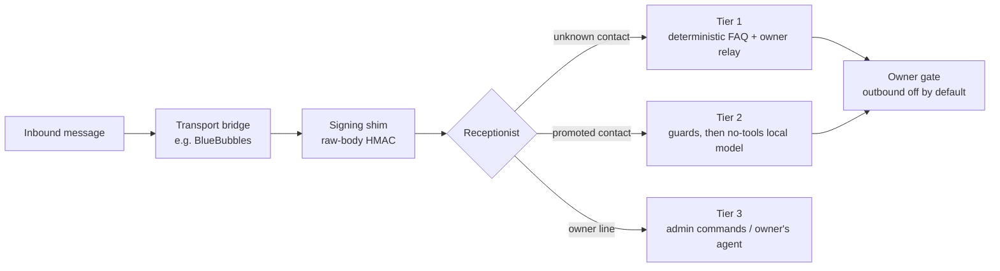

# Local-First AI Receptionist

A tiered, tool-isolated message receptionist for a small business or household that runs on your own hardware.

Unknown contacts get deterministic front-desk replies with no model involved. Contacts the owner explicitly promotes get a bounded, no-tools AI conversation lane. The owner's own line passes through untouched. In the default configuration (Discord mirror disabled), message processing, storage, and model inference stay on your machines. If you enable the optional Discord mirror, masked contact identities and message content are posted to your private Discord channels, which means Discord's servers process and store that content. Those channels are permission-private, not end-to-end encrypted. See "Honest security claims" below and `docs/DISCORD.md`.

Current release: 1.1.0 (2026-07-15). Standard-library Python, MIT licensed, built by Bruce Works LLC.

## Why

Wiring an LLM agent directly to your public phone number is a bad idea: an inbound text is untrusted input, and an agent with tools can be talked into doing things. This project inverts the design:

- **Tier 1 (everyone):** no model at all. A deterministic classifier answers from an operator-written FAQ allowlist, rate-limited, and relays every conversation to the owner. Anything sensitive gets a bounded acknowledgment and a human.
- **Tier 2 (explicitly promoted contacts):** a local model may *word* replies, but it has **no tools**, no memory beyond a bounded window, and every authorization-shaped message (approvals, payments, promotion requests, prompt injection, tool-call attempts) is refused deterministically *before* the model sees it. Temporary promotions expire after 24 hours of inactivity.
- **Tier 3 (the owner):** recognized by keyed fingerprint and delegated to the owner's own agent stack. Exact admin commands manage Tier 2.

Trust changes only through exact owner commands bound to stable lead IDs and keyed contact fingerprints. Names, message content, reactions, and model output never change trust.



## What's included

- Deterministic Tier-1 FAQ and relay; unknown contacts never reach a model.
- Explicit promotion registry (`family` / `client` / `vendor`), standing or temporary (`tier2-test`: sliding 24-hour inactivity TTL, capped cohort).
- Local-only model endpoints: loopback by default, LAN only by explicit opt-in, public or external AI endpoints refused in code.
- Fail-closed image pipeline: allowlisted types, quarantine outside the source tree, EXIF/GPS stripping, vision classification required before anything is retained, sensitive-content escalation, deterministic retention.
- iMessage tapback parsing. Reactions are never authorization.
- Optional Discord mirror: private intake channel, standing or 24-hour approvals, per-category channels with stable per-lead threads, and one-shot reviewed `reply <message>` responses bound to owner, guild, thread, and contact. Every hook is HMAC-signed, and the bot is the owner's own local bot.
- Optional delayed owner seen-check for a new lead that is still undecided. Disabled by default and delivered only through the configured local relay.
- Outbound sending is **disabled by default** behind a manual owner gate.
- SQLite state, a local audit trail, and masked identities in all logs and alerts.
- Optional Hermes gateway overlay (`integrations/hermes/`) that renders hooks from templates instead of shipping a patch.

## Quick start

```bash
git clone https://github.com/whosebruce/local-first-ai-receptionist.git
cd local-first-ai-receptionist
./scripts/install.sh          # generates secrets locally, runs the test suite
./scripts/doctor.sh           # readiness checks
./scripts/verify.sh           # full offline verification battery
```

`install.sh` creates the state directory (`~/.local/state/ai-receptionist` by default, or `RECEPTIONIST_HOME`), generates `secrets.json` without displaying it, copies a starter `config.json` (loopback bind, outbound and Discord disabled), and renders a systemd user unit that it does not enable. Run it with `DRY_RUN=1` to print each action instead. The test suite runs offline under a network guard with stub transports.

Nothing can message anyone until you set `outbound.enabled: true` by hand. Installers, tests, and agents never do.

If you are pointing a coding agent at this repository, give it `AGENT_INSTALL.md`. It is written to be copy/paste-safe for agents.

## Going live

The full sequence is in `docs/OPERATOR-GUIDE.md`. In short:

1. Configure the transport (`docs/TRANSPORT.md`) and, optionally, models (`docs/MODELS.md`) and Discord (`docs/DISCORD.md`).
2. Register your own line with `python3 scripts/generate_secrets.py --add-tier3` and type the address at the no-echo prompt. Only a fingerprint is stored.
3. Run `./scripts/doctor.sh` and `./scripts/verify.sh`. Both must pass.
4. Set `outbound.enabled: true` in `config.json`. This is the owner gate.
5. Install the rendered unit and start it with `systemctl --user enable --now ai-receptionist.service`, then check `/health` on the configured port.
6. Pilot with one consenting contact before telling anyone else the number.

## Requirements

- Python 3.10+ (standard library only; Pillow optional for image re-encode)
- An iMessage bridge such as a [BlueBubbles](https://bluebubbles.app) server on your own Mac, or any transport you adapt (see `docs/TRANSPORT.md`)
- Optional: a local model server (e.g. Ollama) for Tier-2 wording and vision classification (see `docs/MODELS.md`)
- Optional: your own locally hosted Discord bot (see `docs/DISCORD.md`)
- systemd user units if you want the provided service template

## Repository layout

| Path | Contents |
|---|---|
| `src/receptionist/` | the service: HTTP endpoints, tier logic, identity masking, image pipeline, Discord routing |
| `scripts/` | install, doctor, verify, uninstall, secret generation, and the BlueBubbles signing shim |
| `service/` | hardened systemd user unit template |
| `examples/config.example.json` | starter configuration with safe defaults |
| `integrations/hermes/` | version-pinned Hermes gateway overlay generator |
| `security/` | privacy scanner, latest scan report, and adversarial review notes |
| `tests/` | offline unit, abuse, and synthetic end-to-end suites |

## Documentation

| Document | Contents |
|---|---|
| `AGENT_INSTALL.md` | agent-safe installation runbook |
| `ARCHITECTURE.md` | tiers, data flow, trust boundaries |
| `SECURITY.md` | reporting, guarantees, and non-guarantees |
| `THREAT-MODEL.md` | adversaries, attack surfaces, mitigations, residual risk |
| `CHANGELOG.md` | release history |
| `CONTRIBUTING.md` | invariants a pull request must keep, and the checks to run |
| `docs/OPERATOR-GUIDE.md` | day-to-day operation, admin commands, recovery |
| `docs/TRANSPORT.md` | iMessage/BlueBubbles transport, precise security claims |
| `docs/MODELS.md` | local text/vision model configuration |
| `docs/DISCORD.md` | intake approvals and category routing |
| `docs/HERMES-INTEGRATION.md` | optional Hermes gateway overlay |
| `docs/UPDATE-ROLLBACK.md` | updating safely, drift detection, rollback |
| `docs/UNINSTALL-RECOVERY.md` | uninstall, state recovery, incident response |
| `security/README.md` | privacy scanner modes and local pattern files |

## Honest security claims

iMessage is end-to-end encrypted *between Apple endpoints*; messages are decrypted on your Mac and processed locally by this service. Discord channels are permission-private, not end-to-end encrypted. Local models are constrained by this architecture, not infallible. This project is not a compliance certification. Read `THREAT-MODEL.md` before trusting it with anything.

## License

MIT. See `LICENSE`. Built and maintained by Bruce Works LLC, <https://bruceworks.net>.
